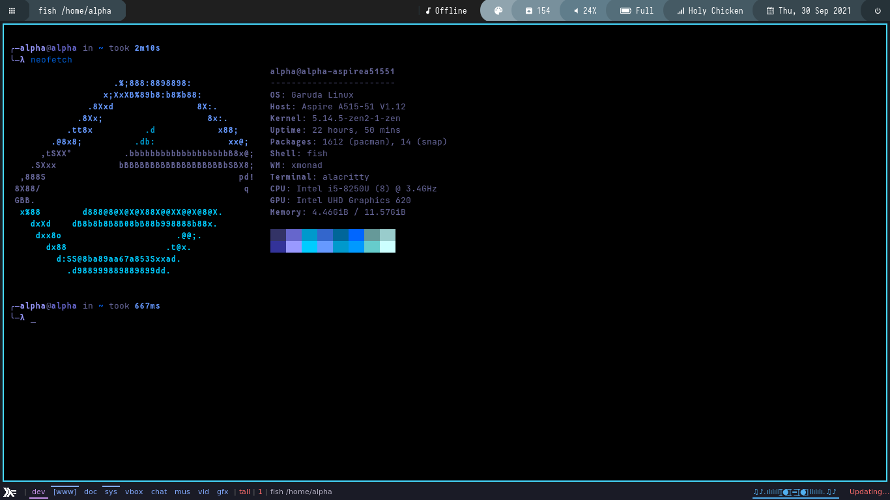
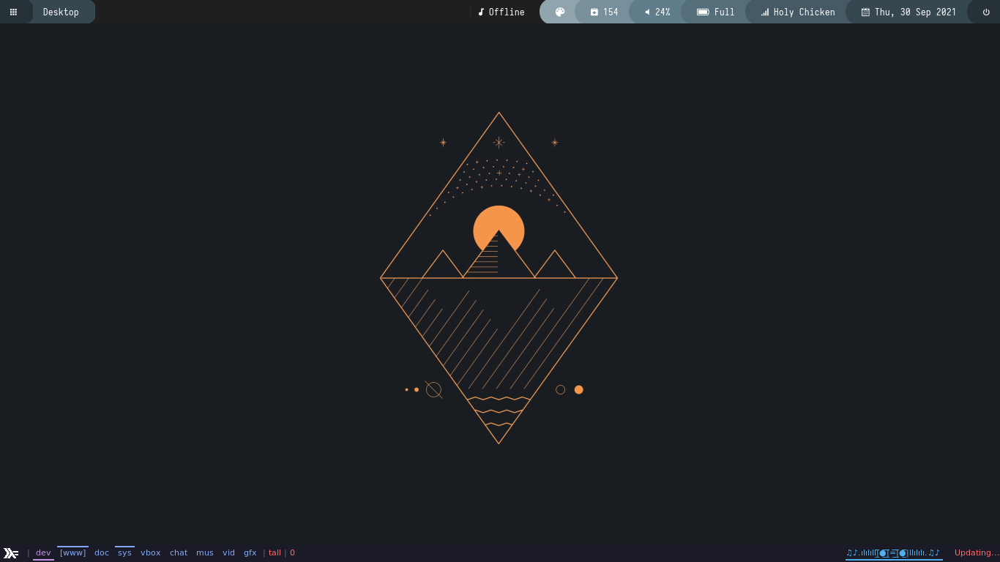
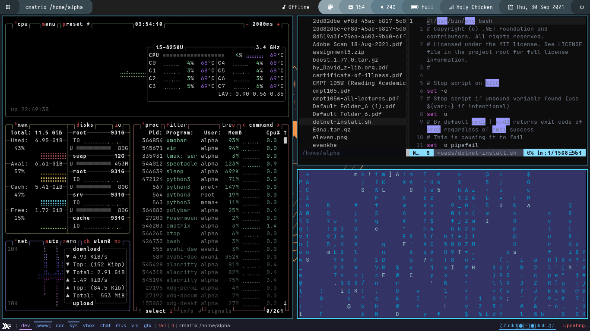
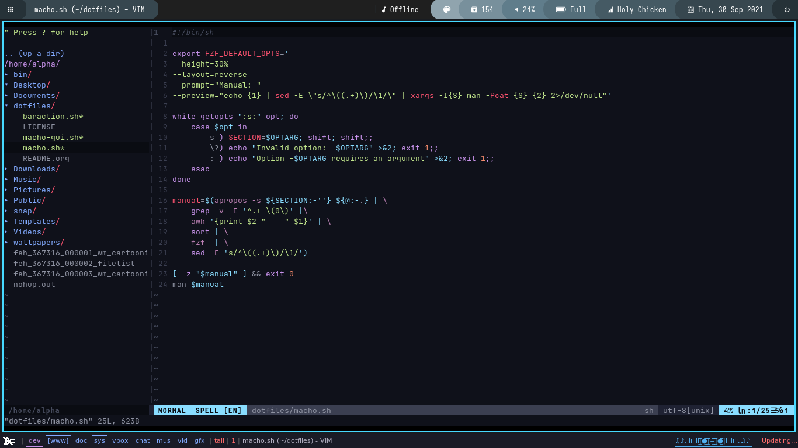

# Dotfiles 


Dotfiles are the customization files (their filenames usually begin with a period) that are used to personalize your Linux or other Unix-based systems. This repository contains my personal dotfiles. 


## Screenshots
<details open>
<summary> <strong><font size="+2"> Abyss </font></strong/></summary>
<br>


- 
- 
- 
- 
</details>
-----
<details open>
<summary> <strong><font size="+2"> Otaku Life </font></strong/></summary>
<br>


- 
- 
- 

</details>

 ------

 ## Dependencies 
1.  Tiling Window manager `Xmonad` 
2. Terminal `Alacritty`
3. Bottom-Tray `Xmobar` 
4. Top-Tray `Polybar`
5. Wallpaper Manager `Nitrogen`
6. Terminal file explorer `ranger`
7. Bluetooth-manager `Blueman-Manager`
8. Network-manager ` Dmenu-network`
9. Audio-manager `Pulse-Audio`
---
* Distro    `Garuda-Linux`

---
## Installation


```bash
  git clone --recursive https://gitlab.com/holychicken99/dotfiles
  cd themes 
```
- choose the theme 
- copy the config files from folder to  their default location

``` bash 
rm ~/.config/alacritty/alacritty.yml
cp {path_to_installtion/{theme_folder}/.alacritty.yml} ~/.config/alacritty/

```
----
 # How To Manage Your Own Dotfiles
There are a hundred ways to manage your dotfiles. Personally, I use the *git bare repository method* for managing my dotfiles. Here is an article about this method of managing your dotfiles: [[https://developer.atlassian.com/blog/2016/02/best-way-to-store-dotfiles-git-bare-repo/][https://developer.atlassian.com/blog/2016/02/best-way-to-store-dotfiles-git-bare-repo/]]

Other articles discussing dotfile management are listed below:
- [[https://distrotube.com/guest-articles/managing-dotfiles-with-rcm.html][Managing dotfiles with style with rcm]] (Ronnie Nissan)
- [[https://distrotube.com/guest-articles/interactive-dotfile-management-dotbare.html][Interactive dotfile management with dotbare]] (Kevin Zhuang)

----


    


## License

The files and scripts in this repository are licensed under the MIT License, which is a very permissive license allowing you to use, modify, copy, distribute, sell, give away, etc. the software. In other words, do what you want with it. The only requirement with the MIT License is that the license and copyright notice must be provided with the software.